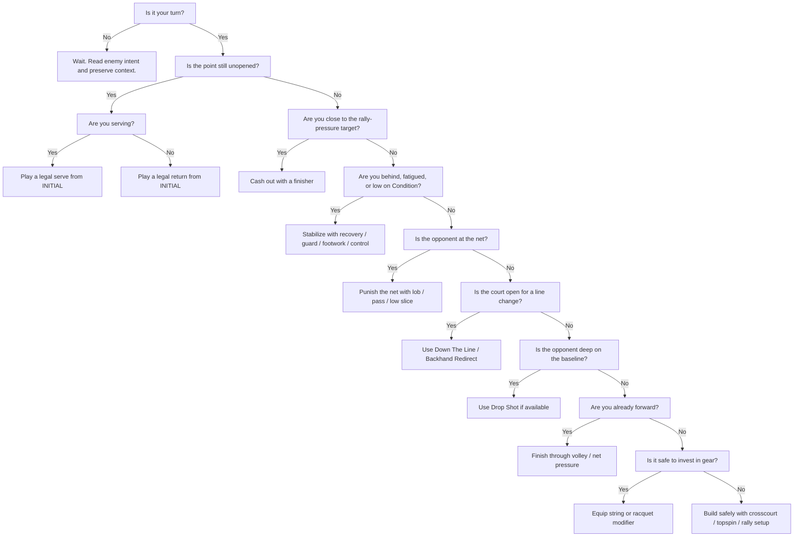

# Card Play Logic Tree

This is the baseline boolean decision tree for playing a turn effectively in a match.

It is aligned to the five-slot hand model:

- `INITIAL` -> serve / return opener
- `SHOT` -> primary strike
- `ENHANCER` -> setup / footwork / recovery
- `MODIFIER` -> string / racquet / spin-style investment
- `SPECIAL` -> signature or boss-pressure slot

## Primary Tree

## Practical Branch Rules

### 1. Opening Contact

If `current_server == player` and `exchanges == 0`:
- play a serve first
- prefer `Kick Serve` when you want momentum and a cleaner plus-one ball
- prefer `Ace Hunter` or another power serve only when the point is already close to ending
- use `Steady Serve` when you need the safest legal opener

If `current_server == enemy` and `exchanges == 0`:
- play a return first
- prefer `Block Return` / `Short-Hop Pickup` when you are under pressure or need to survive
- prefer `Deep Return` / `Backhand Counter Return` when you want to take over the rally immediately
- prefer `Lobbed Return` or `Chip Return` if the server is crowding forward

### 2. Closeout Window

Treat the rally as a closeout window when:
- rally pressure is within roughly `10` of the target
- the ball is sitting high
- the opponent has `Open Court`
- you are already forward at `ServiceLine` or `Net`

Best closeout order:
1. `Overhead Smash` on `HighBall`
2. `Down The Line` / `Backhand Redirect` after crosscourt or open-court setup
3. `Basic Volley` / `Net Rush` when you are already forward
4. power / signature cards when the lane is clean

### 3. Stabilize First

If rally pressure is strongly negative, fatigue is stacking, or Condition is low:
- do not force power cards first
- use `Recover Breath`, `Split Step`, `Block Return`, `Short-Hop Pickup`, or a control/slice ball
- the goal is to stop the point from collapsing before attacking again

### 4. Punish Positioning

If enemy is at `ServiceLine` or `Net`:
- best: `Lob Escape`, `Lobbed Return`
- next: `Passing Bullet`, `Slice Drag`, `Chip Return`

If enemy is deep on the baseline:
- `Drop Shot` is live

If you are already forward:
- `Basic Volley`, `Net Rush`, `Approach Shot` follow-ups become much better

### 5. Safe Pattern Building

If there is no cash-out yet:
- use `Crosscourt Rally` and `Topspin Drive` to build safer pressure
- use `Backhand Redirect` or `Down The Line` only after the lane is opened
- use `ENHANCER` cards when you need guard, draw, stamina, or posture before committing

### 6. Gear Timing

Use `MODIFIER` cards when:
- the point is not one card from ending
- you are not dying immediately
- you have a spare tactical beat to invest in the rest of the match

Priority:
1. string setup if none is equipped
2. racquet setup if none is equipped

Avoid spending the tactical beat on gear when:
- the rally is already in a closeout window
- you are behind badly and need to stabilize now

## Card-Type Priorities

### `INITIAL`
- always resolve this correctly first on unopened points
- wrong opener type is a hard mistake

### `SHOT`
- use for actual pressure gain or finishers
- do not burn a weak line-change shot without setup

### `ENHANCER`
- use when behind, when setting up a next card, or when you need stamina/guard

### `MODIFIER`
- use when stable and early enough in the point/match for long-term value

### `SPECIAL`
- use for signatures when the point state supports them
- if clogged by a boss debuff, account for that before ending turn

## Fast Rules To Remember

- serve first on your serve points
- return first on enemy serve points
- crosscourt opens, down-the-line cashes
- deep enemy -> drop shot
- net enemy -> lob / pass / slice feet
- high ball + forward position -> overhead smash
- behind in pressure or condition -> stabilize before attacking
- gear when safe, not when the point is already swinging hard
